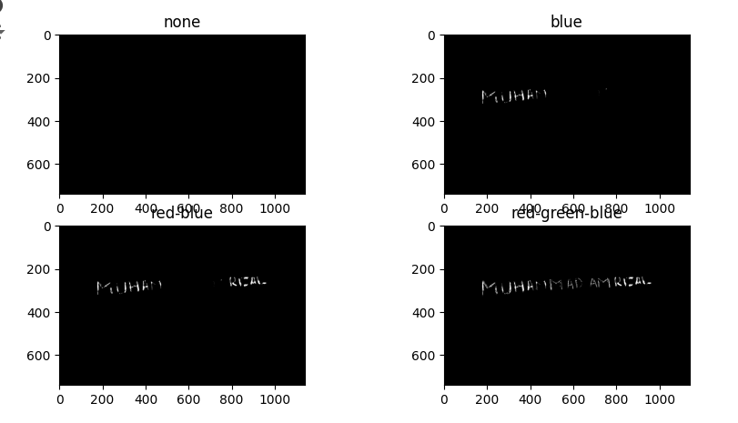

# PROJECT UTS CITRA DIGITAL 2024
NAMA : Muhammad Amrizal

NIM : 202231500

## 1.DETEKSI WARNA PADA CITRA
Langkah Pertama kita import library yang dibutuhkan seperti code dibawah ini :

```
import cv2
import numpy as np
import matplotlib.pyplot as plt 

```

`import cv2`: Ini mengimpor modul OpenCV, yang diperlukan untuk memproses citra.

`import numpy as np`: Ini mengimpor NumPy, pustaka yang digunakan untuk komputasi numerik, yang sering digunakan dalam pengolahan citra.

`import matplotlib.pyplot as plt`: Ini mengimpor modul pyplot dari pustaka Matplotlib, yang akan digunakan untuk menampilkan gambar dan plot.

```
img = cv2.imread('citra.jpeg') 
img_rgb = cv2.cvtColor(img, cv2.COLOR_BGR2RGB)
hsv_img = cv2.cvtColor(img, cv2.COLOR_BGR2HSV)
```

`img = cv2.imread('citra.jpeg')`:  Ini membaca gambar dengan nama 'citra.jpeg' menggunakan fungsi imread() dari OpenCV dan menyimpannya dalam variabel img.

`img_rgb = cv2.cvtColor(img, cv2.COLOR_BGR2RGB)`:* Ini mengonversi gambar dari format BGR (yang digunakan oleh OpenCV secara default) ke format RGB menggunakan fungsi cvtColor() dari OpenCV. Gambar yang telah dikonversi disimpan dalam variabel img_rgb.

`hsv_img = cv2.cvtColor(img, cv2.COLOR_BGR2HSV)`:* Ini juga mengonversi gambar, kali ini ke ruang warna HSV (Hue-Saturation-Value). Ini berguna untuk analisis warna lebih lanjut. Gambar yang telah dikonversi disimpan dalam variabel hsv_img.

kita lanjutkan :

```
# Blue
lower_blue = np.array([20, 10, 10])
upper_blue = np.array([124, 175, 175])
lower_blue_dark = np.array([100, 50, 50])
upper_blue_dark = np.array([140, 255, 255])

# Red
lower_red = np.array([0, 5, 5])
upper_red = np.array([5, 175, 175])
lower_red_dark = np.array([0, 50, 50])
upper_red_dark = np.array([10, 255, 255])
lower_red_alt_dark = np.array([170, 50, 50])
upper_red_alt_dark = np.array([180, 255, 255])

# Green
lower_green = np.array([20, 10, 10])
upper_green = np.array([30, 175, 175])
lower_green_dark = np.array([60, 50, 50])
upper_green_dark = np.array([80, 255, 255])

# None
lower_none = np.array([0, 0,0])
upper_none = np.array([0, 0,0])

```
baris diatas berisi definisi rentang warna dalam format HSV untuk warna biru, merah, dan hijau, serta warna "none" yang mungkin digunakan untuk menunjukkan ketika warna tertentu tidak terdeteksi.

1. **Blue (Biru)**:
   - `lower_blue`: Batas bawah untuk komponen Hue, Saturation, dan Value (Nilai) untuk warna biru yang lebih cerah.
   - `upper_blue`: Batas atas untuk komponen Hue, Saturation, dan Value (Nilai) untuk warna biru yang lebih cerah.
   - `lower_blue_dark`: Batas bawah untuk komponen Hue, Saturation, dan Value (Nilai) untuk warna biru yang lebih gelap.
   - `upper_blue_dark`: Batas atas untuk komponen Hue, Saturation, dan Value (Nilai) untuk warna biru yang lebih gelap.

2. **Red (Merah)**:
   - `lower_red`: Batas bawah untuk komponen Hue, Saturation, dan Value (Nilai) untuk warna merah yang lebih cerah.
   - `upper_red`: Batas atas untuk komponen Hue, Saturation, dan Value (Nilai) untuk warna merah yang lebih cerah.
   - `lower_red_dark`: Batas bawah untuk komponen Hue, Saturation, dan Value (Nilai) untuk warna merah yang lebih gelap.
   - `upper_red_dark`: Batas atas untuk komponen Hue, Saturation, dan Value (Nilai) untuk warna merah yang lebih gelap.
   - `lower_red_alt_dark`: Batas bawah alternatif untuk komponen Hue, Saturation, dan Value (Nilai) untuk warna merah yang lebih gelap di rentang Hue yang berbeda.
   - `upper_red_alt_dark`: Batas atas alternatif untuk komponen Hue, Saturation, dan Value (Nilai) untuk warna merah yang lebih gelap di rentang Hue yang berbeda.

3. **Green (Hijau)**:
   - `lower_green`: Batas bawah untuk komponen Hue, Saturation, dan Value (Nilai) untuk warna hijau yang lebih cerah.
   - `upper_green`: Batas atas untuk komponen Hue, Saturation, dan Value (Nilai) untuk warna hijau yang lebih cerah.
   - `lower_green_dark`: Batas bawah untuk komponen Hue, Saturation, dan Value (Nilai) untuk warna hijau yang lebih gelap.
   - `upper_green_dark`: Batas atas untuk komponen Hue, Saturation, dan Value (Nilai) untuk warna hijau yang lebih gelap.

4. **None (Tidak ada)**:
   - `lower_none`: Rentang nol untuk komponen Hue, Saturation, dan Value (Nilai), mewakili tidak ada warna yang terdeteksi.
   - `upper_none`: Rentang nol untuk komponen Hue, Saturation, dan Value (Nilai), mewakili tidak ada warna yang terdeteksi.

Rentang warna ini digunakan untuk membuat mask pada gambar dalam format HSV untuk mendeteksi keberadaan warna yang ditentukan di dalam gambar.

```
#mendeteksi warna
mask_blue = cv2.inRange(hsv_img, lower_blue, upper_blue) + cv2.inRange(hsv_img, lower_red_dark, upper_red_dark) + cv2.inRange(hsv_img, lower_red_alt_dark, upper_red_alt_dark) + cv2.inRange(hsv_img, lower_green_dark, upper_green_dark)
mask_red = cv2.inRange(hsv_img, lower_green_dark, upper_green_dark) +  cv2.inRange(hsv_img, lower_blue, upper_blue) + cv2.inRange(hsv_img, lower_blue_dark, upper_blue_dark) + cv2.inRange(hsv_img, lower_red, upper_red)
mask_green = cv2.inRange(hsv_img, lower_blue_dark, upper_blue_dark) + cv2.inRange(hsv_img, lower_blue_dark, upper_blue_dark) + cv2.inRange(hsv_img, lower_red_dark, upper_red_dark) + cv2.inRange(hsv_img, lower_red_alt_dark, upper_red_alt_dark)+ cv2.inRange(hsv_img, lower_green_dark, upper_green_dark)
mask_none = cv2.inRange(img_rgb, lower_none, upper_none)

mask_blue2 = cv2.inRange(hsv_img, lower_blue_dark, upper_blue_dark)
mask_red_blue = cv2.inRange(hsv_img, lower_blue_dark, upper_blue_dark) + cv2.inRange(hsv_img, lower_blue_dark, upper_blue_dark) + cv2.inRange(hsv_img, lower_red_dark, upper_red_dark) + cv2.inRange(hsv_img, lower_red_alt_dark, upper_red_alt_dark)
mask_red_green_blue = cv2.inRange(hsv_img, lower_blue_dark, upper_blue_dark) + cv2.inRange(hsv_img, lower_blue_dark, upper_blue_dark) + cv2.inRange(hsv_img, lower_red_dark, upper_red_dark) + cv2.inRange(hsv_img, lower_red_alt_dark, upper_red_alt_dark) + cv2.inRange(hsv_img, lower_green_dark, upper_green_dark) +cv2.inRange(hsv_img, lower_blue, upper_blue)

# Invert coler
mask_blue_inv = cv2.bitwise_not(mask_blue)
mask_red_inv = cv2.bitwise_not(mask_red)
mask_green_inv = cv2.bitwise_not(mask_green)
```
Kode tersebut digunakan untuk membuat masker warna berdasarkan rentang warna yang telah ditentukan sebelumnya. Mari kita jelaskan setiap bagian:

1. **Mendeteksi Warna**:
   - `mask_blue`: Membuat masker untuk warna biru dengan menggabungkan hasil `cv2.inRange()` untuk rentang warna biru dan merah gelap, serta rentang merah alternatif yang lebih gelap dan hijau gelap. Ini akan menangkap warna biru dan beberapa variasi warna merah dan hijau yang lebih gelap.
   - `mask_red`: Membuat masker untuk warna merah dengan menggabungkan hasil `cv2.inRange()` untuk rentang warna hijau gelap, biru, biru gelap, dan rentang merah. Ini akan menangkap warna merah serta beberapa variasi warna biru dan hijau yang lebih gelap.
   - `mask_green`: Membuat masker untuk warna hijau dengan menggabungkan hasil `cv2.inRange()` untuk rentang warna biru gelap, biru gelap, merah gelap, rentang merah alternatif yang lebih gelap, dan hijau gelap. Ini akan menangkap warna hijau serta beberapa variasi warna biru dan merah yang lebih gelap.
   - `mask_none`: Membuat masker kosong yang sama ukurannya dengan gambar asli. Ini digunakan untuk menunjukkan ketika tidak ada warna yang terdeteksi.

2. **Invert Color**:
   - `mask_blue_inv`, `mask_red_inv`, `mask_green_inv`: Menghasilkan masker warna yang diinversi dengan menggunakan `cv2.bitwise_not()` dari masker warna sebelumnya. Ini akan menghasilkan area yang tidak termasuk dalam masker warna tersebut.

Perlu diperhatikan bahwa ada beberapa penulisan yang mungkin tidak konsisten dalam kode, seperti penggunaan rentang warna yang sama dalam beberapa perhitungan masker warna, seperti yang terlihat dalam `mask_red_blue` dan `mask_red_green_blue`. Ini bisa menjadi kesalahan atau bisa jadi disengaja tergantung pada tujuan spesifik dari deteksi warna yang dilakukan.

```
#menampilakan gambar hasil deteksi warna
#Asli
plt.figure(figsize=(10,6))
plt.subplot(2,2, 1)
plt.imshow(img_rgb)
plt.title('Asli')
plt.axis('off')
#biru
plt.subplot(2, 2,2 )
plt.imshow(mask_blue_inv, cmap='gray')
plt.title('Biru')
plt.axis('off')

#merah
plt.subplot(2,2,3)
plt.imshow(mask_red_inv, cmap='gray')
plt.title('Merah')
plt.axis('off')

#hijau
plt.subplot(2,2,4)
plt.imshow(mask_green_inv, cmap='gray')
plt.title('Hijau')
plt.axis('off')
plt.show()
```
Kode tersebut bertujuan untuk menampilkan gambar hasil deteksi warna dalam tata letak yang telah ditentukan. Mari kita jelaskan setiap bagian:

1. **Menampilkan Gambar Asli**:
   - `plt.subplot(2,2,1)`: Membuat subplot di grid 2x2 dengan nomor 1, yang menempatkan gambar asli di sana.
   - `plt.imshow(img_rgb)`: Menampilkan gambar asli yang telah dikonversi menjadi format RGB.
   - `plt.title('Asli')`: Menambahkan judul "Asli" untuk subplot ini.
   - `plt.axis('off')`: Menonaktifkan sumbu pada subplot ini.

2. **Menampilkan Gambar Hasil Deteksi Warna**:
   - `plt.subplot(2,2,2)`: Membuat subplot di grid 2x2 dengan nomor 2, yang menempatkan gambar hasil deteksi warna biru di sana.
   - `plt.imshow(mask_blue_inv, cmap='gray')`: Menampilkan gambar hasil deteksi warna biru yang diinversi dalam skala abu-abu.
   - `plt.title('Biru')`: Menambahkan judul "Biru" untuk subplot ini.
   - `plt.axis('off')`: Menonaktifkan sumbu pada subplot ini.

   - `plt.subplot(2,2,3)`: Membuat subplot di grid 2x2 dengan nomor 3, yang menempatkan gambar hasil deteksi warna merah di sana.
   - `plt.imshow(mask_red_inv, cmap='gray')`: Menampilkan gambar hasil deteksi warna merah yang diinversi dalam skala abu-abu.
   - `plt.title('Merah')`: Menambahkan judul "Merah" untuk subplot ini.
   - `plt.axis('off')`: Menonaktifkan sumbu pada subplot ini.

   - `plt.subplot(2,2,4)`: Membuat subplot di grid 2x2 dengan nomor 4, yang menempatkan gambar hasil deteksi warna hijau di sana.
   - `plt.imshow(mask_green_inv, cmap='gray')`: Menampilkan gambar hasil deteksi warna hijau yang diinversi dalam skala abu-abu.
   - `plt.title('Hijau')`: Menambahkan judul "Hijau" untuk subplot ini.
   - `plt.axis('off')`: Menonaktifkan sumbu pada subplot ini.

Dengan ini, gambar asli dan hasil deteksi warna biru, merah, dan hijau ditampilkan dalam satu tampilan subplot.

Berikut hasil outputannya


Histogram

```
# Hitung histogram untuk setiap gambar
hist_img_rgb = cv2.calcHist([img_rgb], [0], None, [256], [0, 256])
hist_mask_blue_inv = cv2.calcHist([img_rgb], [0], mask_blue_inv, [256], [0, 256])
hist_mask_red_inv = cv2.calcHist([img_rgb], [0], mask_red_inv, [256], [0, 256])
hist_mask_green_inv = cv2.calcHist([img_rgb], [0], mask_green_inv, [256], [0, 256])

# Menampilkan gambar hasil deteksi warna dan histogram
plt.figure(figsize=(8, 8))

# Gambar asli dan histogramnya
plt.subplot(3, 2, 1)
plt.imshow(img_rgb)
plt.title('Asli')
plt.axis('off')

plt.subplot(3, 2, 2)
plt.plot(hist_img_rgb, color='black')
plt.title('Histogram Asli')
plt.xlim([0, 256])

# Mask Biru dan histogramnya
plt.subplot(3, 2, 3)
plt.imshow(mask_blue_inv, cmap='gray')
plt.title('Biru')
plt.axis('off')

plt.subplot(3, 2, 4)
plt.plot(hist_mask_blue_inv, color='blue')
plt.title('Histogram Biru')
plt.xlim([0, 256])

# Mask Merah dan histogramnya
plt.subplot(3, 2, 5)
plt.imshow(mask_red_inv, cmap='gray')
plt.title('Merah')
plt.axis('off')

plt.subplot(3, 2, 6)
plt.plot(hist_mask_red_inv, color='red')
plt.title('Histogram Merah')
plt.xlim([0, 256])

plt.tight_layout()
plt.show()
```

Berikut adalah penjelasan dari setiap bagian kode:

1. **Hitung histogram untuk setiap gambar**: menggunakan fungsi `cv2.calcHist()` untuk menghitung histogram dari gambar asli (`img_rgb`) dan dari masing-masing masker warna (`mask_blue_inv` dan `mask_red_inv`). menghitung histogram untuk saluran intensitas (dalam hal ini, saluran 0, yaitu saluran R pada citra RGB).

2. **Menampilkan gambar hasil deteksi warna dan histogram**: membuat sebuah gambar dengan ukuran 8x8 inch menggunakan `plt.figure(figsize=(8, 8))`.

3. **Gambar asli dan histogramnya**:  menggunakan subplot untuk menampilkan gambar asli dan histogramnya secara bersamaan. Pada subplot pertama (`plt.subplot(3, 2, 1)`), menampilkan gambar asli (`img_rgb`) dengan judul "Asli" dan tanpa sumbu (axis). Pada subplot kedua (`plt.subplot(3, 2, 2)`), menampilkan histogram dari gambar asli (`hist_img_rgb`) dengan judul "Histogram Asli" dan batas sumbu x diatur dari 0 hingga 256.

4. **Mask Biru dan histogramnya**:  untuk menampilkan gambar masker warna biru dan histogramnya. Pada subplot ketiga (`plt.subplot(3, 2, 3)`), menampilkan gambar masker warna biru (`mask_blue_inv`) dengan judul "Biru" dan tanpa sumbu (axis). Pada subplot keempat (`plt.subplot(3, 2, 4)`),  menampilkan histogram dari gambar masker warna biru (`hist_mask_blue_inv`) dengan judul "Histogram Biru" dan batas sumbu x diatur dari 0 hingga 256.

5. **Mask Merah dan histogramnya**:  melakukan hal yang serupa untuk menampilkan gambar masker warna merah dan histogramnya.

Berikut adalah hasil outputannya :


## 2.MENGURUTKAN AMBANG BATAS TERKECIL SAMAPAI DENGAN TERBESAR

```
#none
plt.figure(figsize=(20, 8))
plt.subplot(2, 2, 1)
plt.imshow(mask_none, cmap='gray')
plt.title('none')

#biru
plt.subplot(2,2,2)
plt.imshow(mask_blue2, cmap='gray')
plt.title('blue')

#red-blue
plt.subplot(2,2,3)
plt.imshow(mask_red_blue, cmap='gray')
plt.title('red-blue')

#plt.figure(figsize=(30, 8))
plt.subplot(2,2, 4)
plt.imshow(mask_red_green_blue, cmap='gray')
plt.title('red-green-blue')
plt.show()
```
Kode diatas adalah untuk menampilkan empat gambar dengan label yang berbeda pada empat subplot yang berbeda. Ini dilakukan dengan menggunakan fungsi `plt.subplot()` dari Matplotlib, yang memungkinkan Anda untuk menentukan letak subplot dalam grid.

1. **plt.figure(figsize=(20, 8))**: Ini adalah perintah untuk membuat sebuah gambar baru dengan ukuran (20, 8) dalam satuan yang ditentukan oleh Matplotlib.

2. **plt.subplot(2, 2, 1)**: Ini adalah perintah untuk membuat subplot dengan 2 baris, 2 kolom, dan indeks 1 dalam grid tersebut. Dalam hal ini, kita membuat subplot pertama.

3. **plt.imshow(mask_none, cmap='gray')**: Ini adalah perintah untuk menampilkan gambar menggunakan fungsi `imshow()` dari Matplotlib. Parameter `mask_none` adalah gambar yang ingin ditampilkan, dan `cmap='gray'` digunakan untuk menunjukkan bahwa gambar tersebut akan ditampilkan dalam skala abu-abu.

4. **plt.title('none')**: Ini adalah perintah untuk memberikan judul subplot yang saat ini aktif, dalam hal ini, kita memberinya judul "none".

5. **plt.subplot(2,2,2)**: Ini adalah perintah untuk membuat subplot kedua dalam grid yang sama.

6. **plt.imshow(mask_blue2, cmap='gray')**: Ini adalah perintah untuk menampilkan gambar mask_blue2 dalam skala abu-abu.

7. **plt.title('blue')**: Ini adalah perintah untuk memberikan judul subplot yang saat ini aktif, dalam hal ini, kita memberinya judul "blue".

8. **plt.subplot(2,2,3)**: Ini adalah perintah untuk membuat subplot ketiga dalam grid yang sama.

9. **plt.imshow(mask_red_blue, cmap='gray')**: Ini adalah perintah untuk menampilkan gambar mask_red_blue dalam skala abu-abu.

10. **plt.title('red-blue')**: Ini adalah perintah untuk memberikan judul subplot yang saat ini aktif, dalam hal ini, kita memberinya judul "red-blue".

11. **plt.subplot(2,2,4)**: Ini adalah perintah untuk membuat subplot keempat dalam grid yang sama.

12. **plt.imshow(mask_red_green_blue, cmap='gray')**: Ini adalah perintah untuk menampilkan gambar mask_red_green_blue dalam skala abu-abu.

13. **plt.title('red-green-blue')**: Ini adalah perintah untuk memberikan judul subplot yang saat ini aktif, dalam hal ini, kita memberinya judul "red-green-blue".

14. **plt.show()**: Ini adalah perintah untuk menampilkan semua subplot yang telah dibuat.

Berikut adalah hasil outputnya :


```
hue_channel = hsv_img[:,:,0]

# Temukan ambang batas untuk setiap saluran warna
_, blue_thresh = cv2.threshold(hue_channel, 100, 130, cv2.THRESH_BINARY)
_, red1_thresh = cv2.threshold(hue_channel, 0, 10, cv2.THRESH_BINARY)
_, red2_thresh = cv2.threshold(hue_channel, 170, 180, cv2.THRESH_BINARY)
_, green_thresh = cv2.threshold(hue_channel, 40, 80, cv2.THRESH_BINARY)

# Gabungkan semua ambang batas dan hapus duplikat
all_thresholds = np.unique(np.concatenate((blue_thresh, red1_thresh, red2_thresh, green_thresh)))

# Urutkan ambang batas dari terkecil hingga terbesar
sorted_thresholds = np.sort(all_thresholds)

print("Ambang Batas Terkecil hingga Terbesar:")
print(sorted_thresholds)
```
Maka ouputnya :
```
Ambang Batas Terkecil hingga Terbesar:
[  0  10  80 130 180]
```
Berikut adalah penjelasan dari setiap baris kode:

`hue_channel = hsv_img[:,:,0]`: Ini adalah untuk mengambil saluran hue (H) dari citra dalam ruang warna HSV. Saluran hue menyimpan informasi tentang warna dalam citra.

`blue_thresh = cv2.threshold(hue_channel, 100, 130, cv2.THRESH_BINARY)`: Ini adalah untuk menemukan ambang batas untuk piksel-piksel dalam saluran hue yang memiliki nilai antara 100 dan 130. Piksel-piksel dengan nilai di antara ambang batas ini akan diberi label 1 (putih), sedangkan yang lainnya akan diberi label 0 (hitam).

`red1_thresh` = cv2.threshold(hue_channel, 0, 10, cv2.THRESH_BINARY): Ini adalah untuk menemukan ambang batas untuk piksel-piksel dalam saluran hue yang memiliki nilai antara 0 dan 10 (karena ruang warna HSV adalah lingkaran, nilai 0 dan 180 hampir sama dengan merah).

`red2_thresh = cv2.threshold(hue_channel, 170, 180, cv2.THRESH_BINARY)`: Ini adalah untuk menemukan ambang batas untuk piksel-piksel dalam saluran hue yang memiliki nilai antara 170 dan 180 (dalam kasus merah yang berada di ujung batas 0 dan 180 dalam ruang warna HSV).

`green_thresh = cv2.threshold(hue_channel, 40, 80, cv2.THRESH_BINARY)`: Ini adalah untuk menemukan ambang batas untuk piksel-piksel dalam saluran hue yang memiliki nilai antara 40 dan 80.

`all_thresholds = np.unique(np.concatenate((blue_thresh, red1_thresh, red2_thresh, green_thresh)))`: Ini adalah untuk menggabungkan semua ambang batas yang telah ditemukan sebelumnya dan menghapus duplikatnya.

`sorted_thresholds = np.sort(all_thresholds)`: Ini adalah untuk mengurutkan ambang batas dari terkecil hingga terbesar.

`print("Ambang Batas Terkecil hingga Terbesar:")`: Ini adalah untuk mencetak pesan yang menjelaskan bahwa hasil berikutnya adalah ambang batas yang telah diurutkan.

`print(sorted_thresholds`): Ini adalah untuk mencetak ambang batas yang telah diurutkan.

Dengan menggunakan ambang batas,  dapat memisahkan piksel-piksel dalam citra berdasarkan nilai saluran hue mereka, yang dapat berguna dalam proses pengenalan warna atau segmentasi warna dalam citra.
